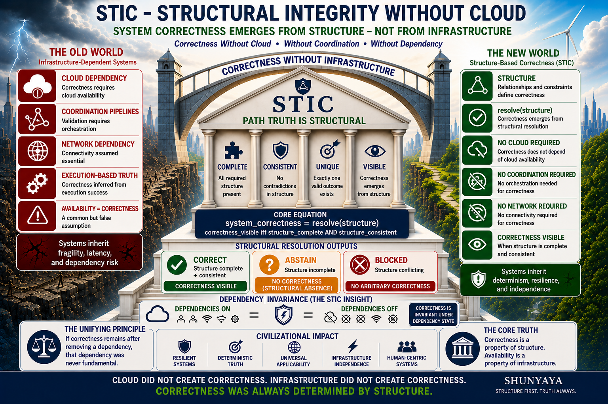

# ⭐ **STIC**

**Structural Integrity without Cloud — Correctness Without Cloud Dependency**

   

   

   

---

Reveals correct system outcomes from structure — independent of infrastructure.

This reference engine demonstrates a **strict invariant**:

system correctness does not depend on cloud infrastructure, centralized validation, or coordination pipelines.

It depends only on structure.

---

## 🌐 **STIC — Structural Integrity without Cloud**

**Where Structure Resolves and Correctness Becomes Visible**

STIC removes infrastructure as a dependency for correctness.

A system does not need cloud, execution environments, or coordination pipelines to be correct.

Correctness is revealed only when structure resolves.

**Deterministic • Structure-Based • No Cloud Dependency • No Centralized Validation • No Infrastructure Dependency for Correctness**

---

## ⚡ **The Claim**

A system can be correct without cloud infrastructure — when structure is sufficient.

---

## 🧱 **Core Principle**

`correctness_visible iff structure_complete AND structure_consistent`

STIC establishes that system correctness is determined by structural sufficiency — not by cloud availability, execution pipelines, or coordination layers.

Infrastructure may enable execution, but correctness is determined solely by structure.

---

## ⚡ **STRUCTURAL VOCABULARY (QUICK REFERENCE)**

### 🧩 **structure_complete**

All required structural elements are present.

### 🧩 **structure_consistent**

No contradictions or conflicts exist in the structure.

### ⚙️ **resolve(structure)**

Deterministic function returning one of: CORRECT, ABSTAIN, BLOCKED

### 👁 **correctness_visible**

True only when `structure_complete AND structure_consistent`

### 🔐 **certificate (σ)**

Deterministic structural fingerprint derived from the resolved outcome  
(e.g., SHA-256 of normalized structure/output)

### 🟡 **ABSTAIN**

Safe absence — structure incomplete → no correctness emitted

### 🔴 **BLOCKED**

Safe rejection — structure conflicting → no correctness allowed

---

## 🚀 **The Core Insight (30-Second Revolution)**

What if system correctness never required cloud infrastructure, coordination, or execution pipelines?

Traditional systems assume:

correctness requires cloud  
validation requires coordination  
systems require continuous connectivity  
execution defines correctness  

STIC demonstrates:

When structure resolves, correctness becomes visible — deterministically and reproducibly.

same structure -> same correctness  
incomplete structure -> no forced correctness  
conflicting structure -> no arbitrary correctness  

This is not an improved cloud system.

This is the removal of cloud as a requirement for correctness.

If correctness remains after removal,  
the dependency was never fundamental.

---

## 🧱 **The Unifying Principle**

`system_correctness = resolve(structure)`

If correctness remains after removing a dependency, that dependency was never fundamental.

---

## 🧩 **Structural Collapse Guarantee**

This framework does not modify classical outcomes.  
It preserves them.

`phi((m, a, s)) = m`

Where:

m = observable system outcome  
a = alignment  
s = structural state  

`structure_complete AND structure_consistent`

No new correctness is created.  
No approximation is introduced.  
The system collapses to the same observable truth.

---

## 🌍 **Civilizational Impact**

From infrastructure-dependent systems to structural correctness.

Traditional systems inherit:  
Dependency • Coordination • Availability risk

STIC systems inherit:  
Determinism • Structural clarity • Correctness independence

This is not optimization — it is dependency elimination.

Correctness was never created by infrastructure — it is determined by structure.

Infrastructure may enable systems to run.  
It does not determine correctness.

---

## ⚠️ **Clarification — Correctness Without Cloud**

STIC does not claim that infrastructure never exists.

What STIC demonstrates:

System correctness does not require infrastructure as a prerequisite or source of truth  
Systems may use infrastructure for execution or coordination  
Correctness is determined solely by whether the structure is complete AND consistent  

Infrastructure may reveal correctness.  
It does not create or determine it.

This is the key distinction:

Traditional systems: `correctness = result of infrastructure`  
STIC: `correctness = result of resolved structure`

The reference implementation may use infrastructure-like constructs for demonstration, but those do not define correctness — structure does.

---

## 🧠 **Practical Interpretation**

Use existing infrastructure for execution and capability.

Use STIC to determine whether the system is structurally correct.

---

## 🧭 **Visual Overview**



---

### 🧱 **Layer Separation (Critical)**

**Structure Layer:**  
determines system correctness  

**Capability Layer (Infrastructure):**  
execution, cloud, coordination, networking (optional)  

**Interface Layer:**  
APIs, outputs, system presentation (optional)  

**STIC operates only at the Structure Layer.**

---

### 🔍 **Truth vs Infrastructure**

STIC determines system correctness — not execution.

It establishes whether a system is structurally valid.

Infrastructure may exist.  
It is not the source of correctness.

**Correctness is determined by structure.**

---

### 🔥 **Break This STIC (Immediate Challenge)**

If infrastructure is required for correctness, this invariant must fail:

`same structure -> same correctness -> same certificate`

Or demonstrate:

incomplete structure -> forced correctness  
conflicting structure -> arbitrary correctness  
infrastructure change -> different correctness  

If none occur, infrastructure is not fundamental.

---

### ⚡ **The Critical Line**

Across every system domain:

remove dependency -> structure remains -> correctness preserved  

Nothing is replaced or approximated — only the dependency is removed.

And correctness remains.

---

### 🌍 **A World Built on Infrastructure**

For decades, systems have been built on dependencies:

cloud infrastructure  
centralized validation  
coordination pipelines  
execution environments  

Each treated as essential.

---

### 🔄 **The Shift**

Across domains:

correctness does not depend on the mechanism we assumed it did  

It is preserved by:

**structure**

---

### ⚡ **The One-Line Breakthrough**

**Correctness does not require infrastructure — when structure is sufficient.**

---

### ⚡ **The Core Truth**

`correctness != infrastructure`  
`correctness = resolve(structure)`

Correctness is a property of structure.  
Availability is a property of infrastructure.

Correctness is invariant under dependency state.  
Availability is not.

---

### ⚡ **Structural Absence Principle**

If structure is not complete and consistent:  
correctness does not exist  

incomplete -> ABSTAIN  
conflict -> BLOCKED  

**Absence is structural truth.**

---

### ⚡ **Try It in 30 Seconds (Zero Dependencies)**

Run:

```
python demo/stic_integrated_demo_v3_2.py
```

**Expected output excerpt:**

Complete structure -> System correctness: CORRECT  
Incomplete structure -> System correctness: ABSTAIN  
Conflicting structure -> System correctness: BLOCKED  
Replay determinism check -> Replay match: True  
Same certificate across dependency states: cloud/network/execution ON or OFF  

---

### 🔐 **Optional Integrity Check**

**Linux/macOS:**

```
sha256sum demo/stic_integrated_demo_v3_2.py
```

**Windows:**

`certutil -hashfile demo\stic_integrated_demo_v3_2.py SHA256`

The hash must match the value in `VERIFY/FREEZE_DEMO_SHA256.txt`.

---

### 🧩 **From Minimal Proof to System-Level Impact**

This reference engine isolates the structural invariant.

It is the smallest visible proof.

Minimal engines isolate the truth.  
Full systems demonstrate it at scale.

Future STIC systems may expand into:

distributed structural validation  
multi-node correctness systems  
infrastructure-independent architectures  
resilience-first system design  
domain-specific structural correctness models  

The invariant remains identical:

`same structure -> same correctness`

The principle does not change with scale.  
Only its visibility increases.

---

## 🧩 **Reference Demonstration**

**Scenario 1 — Valid Structure**  
→ **CORRECT**

**Scenario 2 — Incomplete Structure**  
→ **ABSTAIN**

**Scenario 3 — Conflict**  
→ **BLOCKED**

---

### 🔹 **What this output represents**

correctness appears only when structure resolves  
structure governs visibility  
outcomes are deterministic  

---

## 🧭 **Framework & References**

### **Docs**
- [Quickstart](docs/Quickstart.md)  
- [FAQ](docs/FAQ.md)  
- [Proof Sketch](docs/Proof-Sketch.md)  
- [STIC Concept Diagram](docs/STIC-Diagram.png)  

---

**Note:**  
Certificate identity shown in the STIC concept diagram is illustrative.  
In Phase I, certificate identity depends on structural encoding.  
Canonical identity is a future extension.

---

### **Framework**

- [STIC Framework Document](docs/STIC_v1.3.pdf)  
- [STIC Architecture Notes](docs/STIC-Architecture-Notes.md)  
- [Dependency Elimination Framework](docs/Dependency-Elimination-Framework.png)  
- [Shunyaya Structural Stack](docs/Shunyaya-Structural-Stack.png)  

---

STIC is part of the **Dependency Elimination Framework**, where:

`correctness = structure`

Removing assumed dependencies does not break correctness —  
it reveals that correctness was always determined by structure.

---

## 🧪 **Demo**

- [stic_integrated_demo_v3_2.py](demo/stic_integrated_demo_v3_2.py)  
- [STIC_HTML_v3_2.html](demo/STIC_HTML_v3_2.html)  

---

## 🔐 **Verification**

- [VERIFY.txt](VERIFY/VERIFY.txt)  
- [FREEZE_DEMO_SHA256.txt](VERIFY/FREEZE_DEMO_SHA256.txt)  

---

## 📁 **Repository Structure**

- `demo/` — reference kernel  
- `docs/` — conceptual and framework documentation  
- `VERIFY/` — reproducibility and integrity checks  

---

## ⚡ **Structural Model**

`resolve(structure) ->`

CORRECT  
ABSTAIN  
BLOCKED  

---

## 🛡 **Structural Safety & Guarantees**

STIC never forces correctness.

incomplete -> no correctness (ABSTAIN)  
conflict -> no correctness (BLOCKED)  
complete -> deterministic correctness (CORRECT)  

identical structure -> identical correctness  
different correctness -> different structure  

Reproducible across runs.

**Classical collapse preserved:**

`phi((m, a, s)) = m`

Absence is truth.  
Silence is valid output.  

**This is structural safety.**

---

## 🔥 **Deterministic Invariant**

`same structure -> same correctness -> same certificate`

No cloud, infrastructure, or execution path can alter this.

---

## 📊 **Comparison**

| Model                  | Cloud Required | Structure-Based | Deterministic |
|------------------------|----------------|-----------------|---------------|
| Cloud-Centric Systems  | Yes            | No              | Conditional   |
| Distributed Systems    | Yes            | Partial         | Conditional   |
| STIC                   | No             | Yes             | Yes           |

---

## 🧠 **Critical Insight**

System does not:

depend on cloud  
depend on execution  
depend on coordination  

Correctness is not visible when structure is incomplete or inconsistent.

---

## 🔥 **STIC Challenge — Where Structure Preserves Correctness Without Infrastructure**

Explore real test scenarios where traditional systems depend on cloud, coordination, or infrastructure to determine correctness — and how STIC preserves correctness deterministically from structure alone.

→ [STIC Challenge](docs/STIC-Challenge.md)

---

## 🧾 **Structural Lineage**

SLANG → correctness without execution  
STIME → correctness without time  
STINT → correctness without connectivity  
STILE → correctness without communication  
SVARE → correctness without computation  
STIC → correctness without cloud dependency  

---

## ⚖️ **What STIC Is / Claims / Does Not Claim**

### **STIC IS:**

a structural system correctness model  
a deterministic proof that correctness emerges from structure  
a system where the same structure always produces the same correctness and certificate  
a model where incomplete or conflicting structure produces no correctness (safe absence)  
a minimal reference model for correctness without cloud dependency  
a Phase I demonstration of structure-first system correctness  
part of the Shunyaya Dependency Elimination Framework  

---

### **STIC CLAIMS:**

System correctness can be determined from complete AND consistent structure alone  
Cloud infrastructure is not required as a prerequisite for correctness  
Structure — not infrastructure — defines truth  

---

### **STIC IS NOT:**

a replacement for cloud platforms or distributed systems  
a full infrastructure or orchestration framework  
a production-ready system for large-scale deployment (Phase I scope)  
a performance optimization model for existing systems  
a certified financial, safety-critical, or real-time system (research artifact only)  
an optimization of infrastructure — it is a different correctness model  

---

### **STIC DOES NOT CLAIM:**

that the reference system operates without any infrastructure usage  

that infrastructure execution or coordination defines correctness  

that it is ready for safety-critical, financial, or real-time production use without independent validation  

---

## 🔬 **PHASE I ASSUMPTIONS AND VERIFICATION**

### **What STIC assumes (Phase I):**

Structure definitions are provided by the caller and treated as authoritative  

The reference implementation uses only Python standard library (no external dependencies)  

Certificates are structural fingerprints — not externally signed cryptographic proofs  

The model applies to structure-resolvable system correctness  
(message, identity, path, validation, etc.)  

---

### **How to independently verify the core claims:**

Run the demo multiple times  
→ identical certificates must be produced  

Toggle all dependency states in the HTML demo  
→ correctness and certificate remain unchanged  

Modify structure  
→ remove a required element → ABSTAIN  
→ introduce conflict (e.g., hash mismatch) → BLOCKED  

Run on different machines or environments  
→ identical structure must produce identical certificate  

---

### **Verification requires:**

No cloud  
No network  
No external services  

Only structure  

---

## 📜 **License**

See: [LICENSE](LICENSE)

### **Reference Implementation (This Repository):**

This STIC reference engine (Python + HTML demo) is released as an **Open Standard** —  
free to use, study, implement, extend, and deploy.

It represents a minimal deterministic demonstration of structural correctness resolution.

---

### **Architecture and Documentation:**

Licensed under CC BY-NC 4.0

---

## 🔭 **Roadmap**

**Multi-structure resolution**  
Cross-component correctness evaluation across independent structures  
Status: Planned  

**Structural system graphs**  
Hierarchical validation and dependency mapping across structures  
Status: Planned  

**Distributed structure models**  
Multi-node correctness without coordination (extends ORL + STINT principles)  
Status: Planned  

**Canonical certificate identity**  
Same resolved correctness → stable canonical certificate across representations  
Status: Planned  

**Domain extension packs**  
Predefined structural templates for APIs, identity, messaging, audit systems  
Status: Open  

**Formal verification**  
Lightweight machine-checked invariants (Lean / Coq or equivalent)  
Status: Research  

**CLI + Web Playground**  
`stic validate` command-line tool + browser-based structure testing interface  
Status: Planned  

**Language bindings**  
Python (reference), WebAssembly, Rust, others  
Status: Future  

---

## 🔗 **Related Structural References**

STIC is part of a broader structural ecosystem where each system removes a specific assumed dependency — yet correctness remains preserved.

`correctness = resolve(structure)`

---

## 🧱 **Cross-System Dependency Elimination Map**

| Domain        | System | Removed Dependency                  | What Preserves Correctness |
|---------------|--------|------------------------------------|----------------------------|
| Computation   | [SLANG-Computation](https://github.com/OMPSHUNYAYA/SLANG-Computation) | Execution flow             | Structure |
| Computation   | [STOCRS](https://github.com/OMPSHUNYAYA/STOCRS)                     | Execution pipelines        | Structure |
| Arithmetic    | [SVARE](https://github.com/OMPSHUNYAYA/SVARE)                        | Computation                | Structure |
| Time          | [STIME](https://github.com/OMPSHUNYAYA/Structural-Time)              | Clocks                     | Structure |
| Time          | [SSUM-Time](https://github.com/OMPSHUNYAYA/SSUM-Time)                | Time reconstruction        | Structure |
| Ordering      | [ORL](https://github.com/OMPSHUNYAYA/Orderless-Ledger)              | Ordering / sequence        | Structure |
| Connectivity  | [STINT-Money](https://github.com/OMPSHUNYAYA/STINT-Money)           | Continuous connectivity    | Structure |
| Communication | [STILE](https://github.com/OMPSHUNYAYA/STILE)                       | Messaging / network        | Structure |
| Traversal     | [STRAL-Path](https://github.com/OMPSHUNYAYA/STRAL-Path)             | Traversal / search         | Structure |
| Infrastructure| STIC                                                                | Cloud / infrastructure     | Structure |
| Finance       | [SLANG-Money](https://github.com/OMPSHUNYAYA/SLANG-Money)           | Transactions               | Structure |
| Audit         | [SLANG-Audit](https://github.com/OMPSHUNYAYA/SLANG-Audit)           | Verification workflows     | Structure |

---

## 🌌 **The Unifying Insight**

remove dependency -> structure remains -> correctness preserved  

And correctness does not break.

---

## 🧭 **Structural Lineage**

SLANG → execution  
STIME → time  
STINT → connectivity  
STILE → communication  
STRAL → traversal  
SVARE → computation  
STIC → cloud / infrastructure  

---

## 📝 **Note on Naming**

Shunyaya (and STIC) has no relation to the philosophical term Śūnyatā (emptiness).  
The name refers to a structural interpretation of Zero as an active reference baseline.

---

## ⚡ **The Pattern**

Each system answers a deeper question:

Does correctness depend on what we assumed it did?

STIC answers:

Does system correctness require infrastructure?

**No. It requires structure.**

---

## 🧭 **Final Statement**

Cloud did not create correctness.  
Infrastructure did not create correctness.  
Execution did not create correctness.  

Correctness is not produced — it is revealed by structure.

When structure is complete and consistent:  
correctness becomes visible.

Deterministically.  
Reproducibly.  
Independently of infrastructure.

**This is STIC.**
